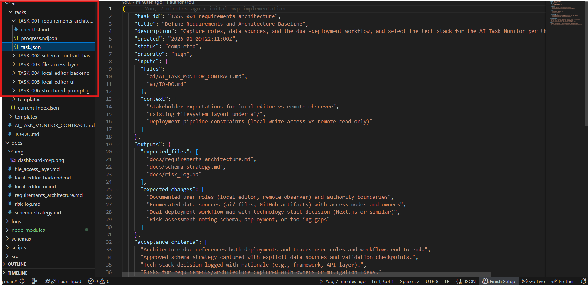
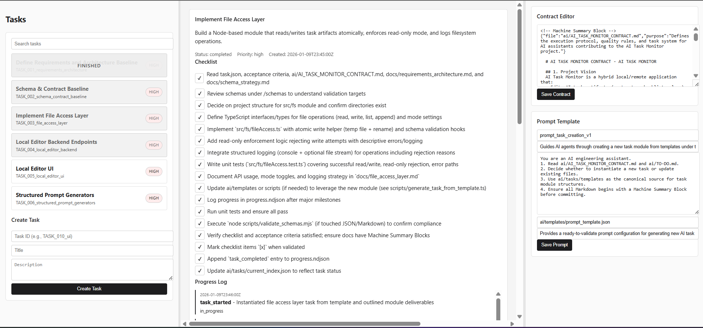

# AI Task Monitor

Local tooling that helps you create AI tasks, keep context organized, and show clients (or yourself) steady progress using AI-assisted coding. It keeps AI output clean by enforcing guardrails (schemas, checklists, Machine Summary Blocks). A simple React/Vite UI talks to an Express backend so you can maintain the `ai/` folder without touching files manually, and a lightweight "website viewer" mode is planned so clients can monitor progress remotely without write access.

## How It Works / Runs

Every AI agent working in this repo reads it's `ai/AI_*_CONTRACT.md`, follows its instructions, and writes progress into `ai/tasks/*/progress.ndjson` so humans (and other AIs) can see exactly what happened. Checklists are toggled step-by-step, acceptance criteria live in `task.json` in it's corresponding 'task module', and the contract ensures no task is marked complete without the right logs.

- `npm install` at repo root (installs backend + script deps).  
- `npm run dev` starts the backend on http://localhost:3000.  
- `npm run ui:dev` (in another terminal) launches the Vite client on http://localhost:5173 with `/api` proxied to the backend.
- See `docs/feature_workflow.md` for the feasibility-first workflow, `docs/task_reordering.md` for how the backlog order is enforced, and `docs/log_diff_strategy.md` for the diff payload requirement on every progress entry.

##

**Turns Into ↓**

